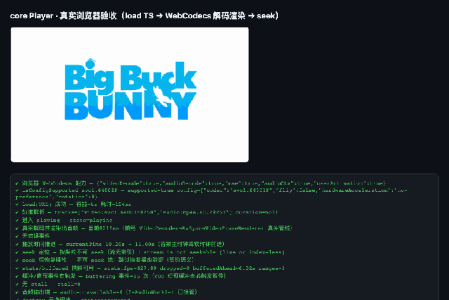
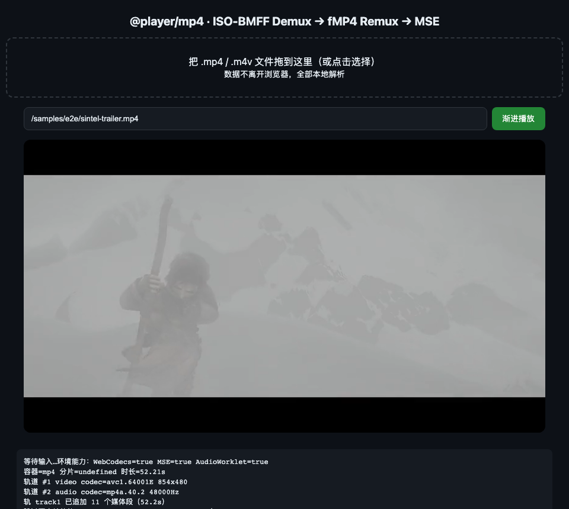
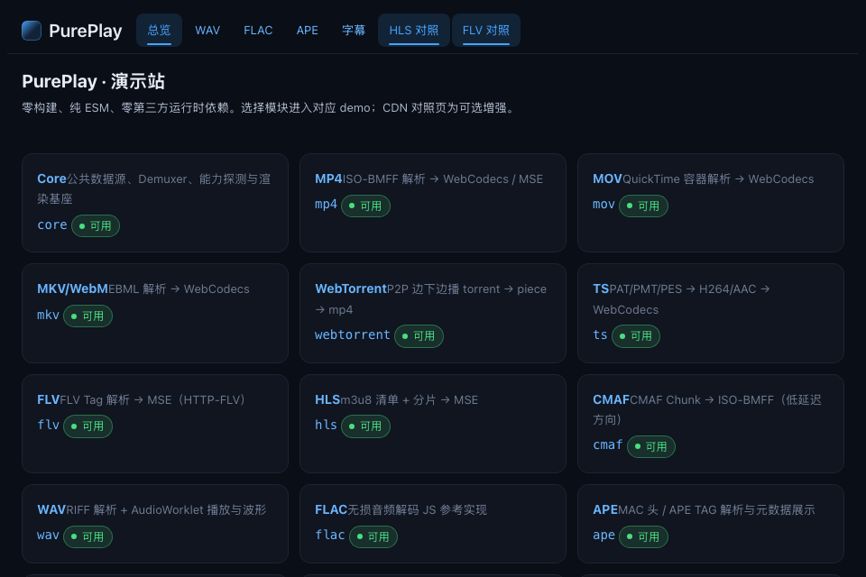

# 纯前端实现播放器（下一代 ffplay.js 方向）

浏览器沙箱内完成「Container 解析 → Demux → WebCodecs 解码 → Canvas / AudioWorklet 渲染」的完整媒体管线。
零构建、纯 ESM、零第三方运行时依赖。需求与可行性依据见 [docs/00-需求与可行性结论.md](docs/00-需求与可行性结论.md)，
测试与工程约定见 [docs/TESTING.md](docs/TESTING.md)。

## 效果演示

**🌐 在线演示（免克隆直接玩）：<https://zhenghy-gh.github.io/pure-webcodecs-player/>**

真实 Chrome 无头驱动本仓库代码的实拍（非效果图）——**WebCodecs 主路线**：TS 流 → 解复用 →
`VideoDecoder` 真实解码 → Canvas 渲染，下方日志为 15 步端到端自断言全部 PASS：

<p align="center">
  
</p>

| MP4 渐进播放（MSE 路线，Sintel 预告片） | 演示站（16 模块 demo 入口） |
|---|---|
|  |  |

> 采集方法：`scripts/e2e/`（playwright 驱动系统 Chrome）+ 素材 `samples/e2e/`（bbb480_30s.ts / sintel-trailer.mp4），均来自真实运行中的页面；复现命令见下文「真机端到端验收」。

**不想克隆也能用**：仓库是零构建纯 ESM，除了上面的在线演示，还能通过 **npm / jsdelivr CDN / GitHub Pages** 三种方式直接 `import` 到你的项目——见下方「使用方式 §2」。

## 快速开始

```bash
npm test         # node --test 递归运行全部 __tests__/*.test.{js,mjs}（Node ≥ 22）
npm run demo     # 启动零依赖静态服务器 http://localhost:8080 （支持中文路径 / Range / 目录列表）
npm run lint     # 可选：语法 + 卫生检查（零依赖）
npm run fixtures # 重建各模块落盘 fixture（产物不入库）
npm run gateway  # 本地 WS 测试网关（rtmp/rtsp 桥接联调用）
```

要求 Node.js ≥ 22（`node --test` 的 glob 参数需要 v22+；本仓库开发基线 v22.23.1）。

## 使用方式

### 1. 浏览器直接体验（推荐先跑这个）

**无需克隆，在线直接玩**：**[https://zhenghy-gh.github.io/pure-webcodecs-player/](https://zhenghy-gh.github.io/pure-webcodecs-player/)**（GitHub Pages，随 main 分支自动更新；演示站、mp4/mse、音频、字幕、HLS 等 demo 全部可用，本地文件拖进页面，数据不离开浏览器）。

想在本地跑也一样简单：

```bash
git clone https://github.com/zhenghy-gh/pure-webcodecs-player.git
cd pure-webcodecs-player
npm run demo        # 启动零依赖静态服务器（支持中文路径 / HTTP Range / 目录列表）
```

> `npm run demo` 启动的是**你本机**的服务器，下面出现的 `localhost` 地址只在你自己的浏览器里有效。不想折腾就直接用上面的在线链接。

然后在**本机浏览器**打开：

- `http://localhost:8080/site/demo/` —— **演示站**，16 个模块的 demo 入口卡片
- 例：`http://localhost:8080/mp4/demo/` 把本地 `.mp4` 拖进页面即可播放——**数据不离开浏览器**，全部本地解复用 + 重封装 + MSE 解码
- 音频（wav / flac / ape）、字幕、HLS、WebTorrent 等同理，入口见演示站

### 2. 代码集成：`createPlayer` 一条龙（推荐）

已发布：**`pure-webcodecs-player@0.1.0`**（零构建纯 ESM 单包，`.` 为 core 入口、`./mp4` 等 15 个容器/协议模块为子路径）。三种引入任选其一：

```bash
npm i pure-webcodecs-player                                  # 方式一：npm（推荐）
# 方式二：CDN 直引，无需安装（仓库即零构建纯 ESM，jsdelivr 直接当包源）
#   import('https://cdn.jsdelivr.net/npm/pure-webcodecs-player@0.1.0/core/src/index.js')
#   import('https://cdn.jsdelivr.net/npm/pure-webcodecs-player@0.1.0/mp4/src/index.js')
# 方式三：GitHub Pages 直引（与在线演示同源，随 main 自动更新）
#   import('https://zhenghy-gh.github.io/pure-webcodecs-player/core/src/index.js')
```

```js
import { createPlayer, registerDemuxer } from 'pure-webcodecs-player';
import * as mp4Mod from 'pure-webcodecs-player/mp4';
import * as tsMod from 'pure-webcodecs-player/ts';

// 宿主注册容器模块（生产协议），URL 自动探测容器并选路
registerDemuxer(mp4Mod);
registerDemuxer(tsMod);

const player = await createPlayer({
  url: 'https://example.com/movie.mp4',
  canvas: document.getElementById('stage'),      // WebCodecs 路线；MSE 路线改传 mediaElement: <video>
  routePreference: ['webcodecs', 'mse'],          // 能用 WebCodecs 就不落 MSE
});

await player.load();
await player.play();                              // 起播前向缓冲 3s 后出水
player.on('firstframe', () => console.log('首帧已出'));
player.on('error', (e) => console.error(e.code, e.detail));

await player.seek(20_000_000);                    // seek 20s（整数 µs，关键帧对齐）
await player.selectTrack('audio', 1);             // 切音轨
await player.destroy();                           // 幂等释放解码器与元素
```

### 3. 底层 API：Demuxer / DataSource 直用

只要解复用不要播放管线时（如转码器、编辑器、元数据提取）：

```js
import { Mp4Demuxer, HttpRangeDataSource } from 'pure-webcodecs-player/mp4';  // 源码方式集成则用 './mp4/src/index.js'

const demuxer = new Mp4Demuxer(
  new HttpRangeDataSource('https://example.com/movie.mp4'),  // 256KB 分块 LRU 缓存
);
const info = await demuxer.open();     // → MediaInfo（轨道/时长/seekable），同时 emit 'media-info'
for (const t of info.tracks) console.log(t.type, t.codec, t.width ?? `${t.sampleRate}Hz`);

const sample = await demuxer.readSample(info.tracks[0].id);  // pull 主通道；EOS → null
// sample: { trackId, codec, timestamp(整数µs), duration, data, keyframe }

await demuxer.seek(20_000_000);        // → { actualTimestampUs }；无索引容器 reject SEEK_UNSUPPORTED
await demuxer.destroy();               // 幂等
```

所有容器/传输模块 API 同构（同一基类契约）：`hls`（m3u8 + 分片）、`mkv`（EBML）、
`webtorrent`（`createSource` P2P 边下边播）、`rtmp`/`rtsp`（WS 网关桥接）等，
形状与差异见各模块 README 与 [docs/CONTRACTS.md](docs/CONTRACTS.md)。

### 4. 真机端到端验收

```bash
node scripts/e2e/run.mjs                  # TS 素材 / WebCodecs 主路线（15 步自断言）
node scripts/e2e/run.mjs --media=/samples/e2e/sintel-trailer.mp4 --seekUs=20000000   # MP4 素材（含 seek）
```

真实系统 Chrome + 真实 WebCodecs 跑完 `load → 首帧 → 播放推进 → seek → stats → destroy` 全链路。

> 素材说明：`samples/e2e/`（约 32MB 媒体文件）**不入库**，克隆后默认路径为空。可把自己的 `.ts` / `.mp4` / `.flac` / `.mkv` 文件放进 `samples/e2e/` 后用 `--media=/samples/e2e/文件名` 指定（TS 无索引会按契约判不可 seek，属预期行为）。

## 统一管线

```
输入(File/HTTP Range/WebSocket/WebRTC)
        │
  Container/Demuxer（各模块自研解析）
        │
  EncodedVideo/AudioChunk
        │
    WebCodecs 解码
        │
  Canvas / WebGPU ＋ AudioWorklet 渲染
```

- RTMP / RTSP 浏览器不可直连（无 TCP/UDP API），落地形态为 WebSocket 网关桥接或转 WebRTC。

